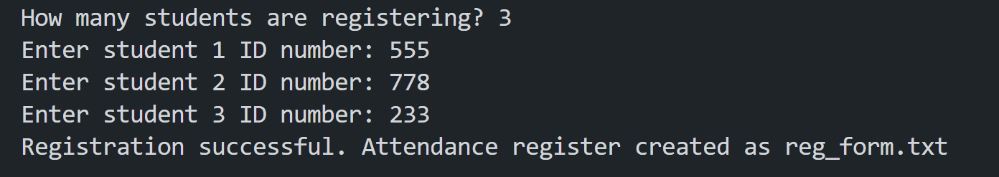
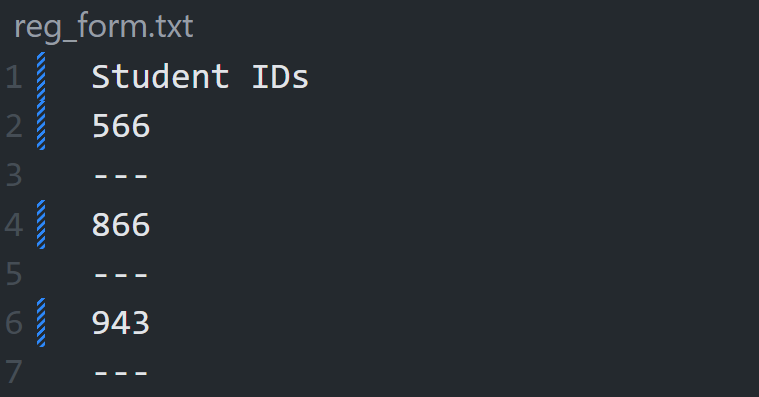

# Student_register
## Description
This program allows a user to register students for an exam venue.
● First, the user is asked how many students are registering.
● A for loop runs for that number of students.
● Each time the loop runs the program asks the user to enter the
next student ID number.
● The program will write each of the ID numbers to a text file called reg_form.txt.
● A dotted line is included to the printout after each student ID because this document can be used as an attendance register, which the students will sign when they arrive at the exam venue.

## Table of Contents
- [Student\_register](#student_register)
  - [Description](#description)
  - [Table of Contents](#table-of-contents)
  - [Installation](#installation)
  - [Usage](#usage)
  - [License](#license)
  - [Contributing](#contributing)
  - [Credits](#credits)
  - [Tests](#tests)
  - [Questions](#questions)

## Installation
How to install Python in terminal?
Step 1: Download the Python installer. Visit the official Python website and download the latest version of Python 3.x for Windows. ...
Step 2: Run the Installer. ...
Step 3: Customize the Installation (Optional) ...
Step 4: Install Python. ...
Step 5: Verify the installation.

How to add pip to path Python?
How to Add Python Pip to Path
Locate pip Installation:
Modify the PATH Environment Variable for this session:
Modify the PATH Environment Variable permanently:
Verify the Modification:
Locate pip Installation:
Modify the PATH Environment Variable:
Add the Path to the Environment Variables:
Verify the Modification:

## Usage

A screenshot of the user input is shown here:

A screenshot of the printed work is shown here:

The repository can be accessed using this link:https://github.com/Mikemupararano/student_register.

## License
This application is covered under the MIT license.

## Contributing
 N/A

## Credits
N/A
## Tests
N/A

## Questions
For any questions or concerns, please contact me at [kudath@yahoo.co.uk](mailto:kudath@yahoo.co.uk).
You can also find me on GitHub: [https://github.com/Mikemupararano](https://github.com/https://github.com/Mikemupararano)
